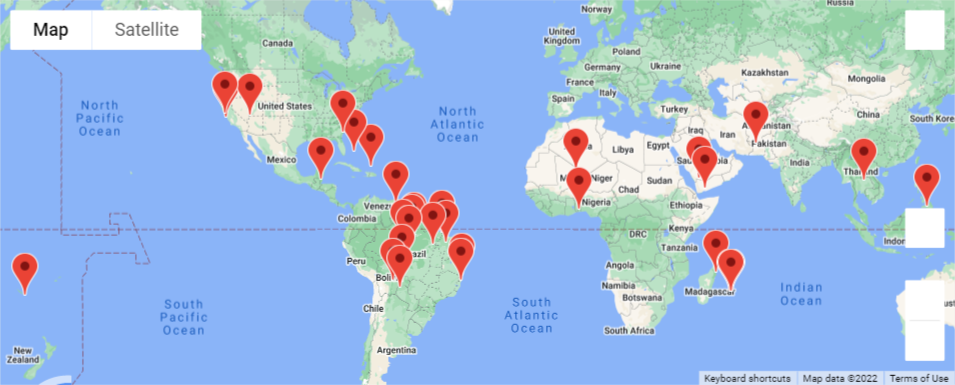
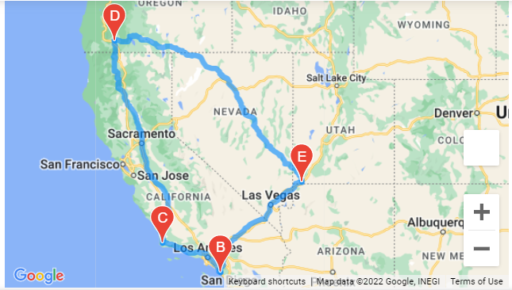

# WeatherPy with Python APIs (Module 6)

[Link to Jupyter Notebook Deliverable 1 code](Weather_Database.ipynb)
[Link to Jupyter Notebook Deliverable 2 code](vacation_search.ipynb)
[Link to Jupyter Notebook Deliverable 3 code](vacation_Itinerary.ipynb)

## Overview of WeatherPy Vacation Travel Analysis

### Purpose
Completed an analysis of worldwide weather and location data to determine a recommended vacation itinerary based on customer input preferences.

Provided the following assessments:

1. Generated a set of 2,000 random latitudes and longitudes, retrieved the nearest city, and retrieved the current weather description for each city. 

2. Used input statements to retrieve customer weather preferences, then used those preferences to identify potential travel destinations and nearby hotels. 

3. Used the Google Directions API to create a travel itinerary that shows the route between four cities chosen from the customer’s possible travel destinations. 

### Resources

This project was prepared using the following:
* Python 3.7.6
* Anaconda 4.12.0
* Jupyter Notebook 6.4.5
* OpenWeather API  https://openweathermap.org/api
* Google Maps Platform API https://mapsplatform.google.com/ 
